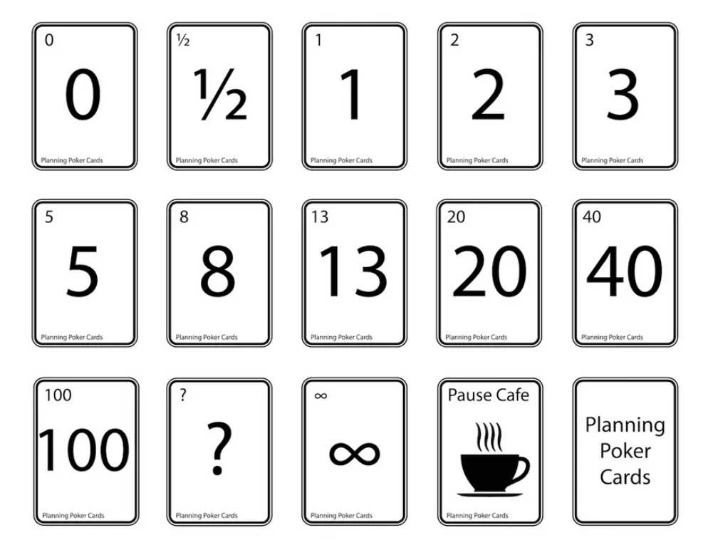

# Poker Planning – ett kul sätt att estimera uppgifter 🃏

Poker planning är ett sätt för team att gemensamt bedöma hur stora eller svåra olika arbetsuppgifter är. Alla i teamet får möjlighet att komma till tals, vilket både ökar engagemanget och möjliggör kunskapsöverföring. Genom diskussionerna som uppstår när åsikterna går isär får man en bättre gemensam förståelse för uppgifterna.

I ett specifikt team och projekt kommer poängen med tiden att motsvara en ungefärlig arbetsinsats. Detta brukar klarna efter att teamet genomfört några sprintar (ofta 4–5), då man kan räkna ut ett snitt: *"För oss motsvarar 1 poäng ungefär X mantimmar."*

> 💡 **Tips för Trello-användare:** Det finns gratis *Power-Ups* som gör det möjligt att lägga till estimeringar direkt på korten – t.ex. *Scrum for Trello* eller *Card Size by Screenful*.

Här har ni även en webapplikation som ni kan använda för att "spela" poker planning: https://www.scrumpoker-online.org/en/

## Poker planning – steg för steg 📝

1. Bryt ner alla user stories till mindre, hanterbara tasks.  
2. Börja spela planning poker.

### Kalibrera er 🎯

För att få en gemensam förståelse för poängskalan är det bra att kalibrera teamet:

- Välj en väldigt enkel task – enas om att den är **1 poäng**.  
- Välj en mycket svår task – enas om att den är **20 poäng**.  
- Välj en medelsvår task – enas om att den är **8 poäng**.

### För varje task:

- Alla väljer ett kort.
- Alla visar sina kort samtidigt.
- Om inte alla valt samma:
  - Den som valt högst respektive lägst förklarar varför.
  - Om någon valt frågetecknet får någon annan i teamet förklara uppgiften.
- Diskutera och spela om tills teamet når konsensus.
- Skriv upp poängen och gå vidare till nästa task.

## Speciella kort 🃏

- **❓** = Jag förstår inte uppgiften – någon måste förklara.  
- **0️⃣** = Den här uppgiften är redan klar.  
- **4️⃣0️⃣** = Uppgiften är för stor – bör delas upp i 2–3 mindre tasks.  
- **💯** = Alldeles för stor – dela upp i 4–6 mindre tasks.  
- **☕** = Jag behöver en paus – respekteras alltid, även om bara en spelare det.  
- **♾️** = Den här uppgiften går aldrig att slutföra (t.ex. återkommande underhåll).
