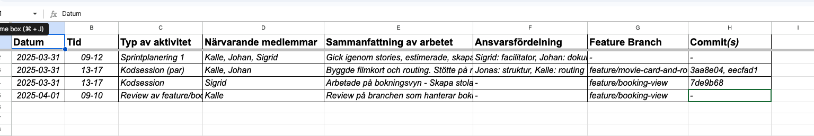

# 📝 Gruppinlämningsuppgift: Filmvisarna – Bygg ett bokningssystem för bio

Företaget **Filmvisarna AB** är en lokal biografkedja som vill konkurrera med de större aktörerna. De har två salonger i Småstad och visar flera filmer dagligen. Nu söker de ett utvecklingsteam som kan ta fram en fungerande prototyp för ett webbaserat bokningssystem.

Ni har blivit anlitade som utvecklare i projektet och ska tillsammans leverera en fungerande webbapplikation byggd med modern webbutvecklingsteknik.

## 🎯 Uppgiftens mål

Skapa en **fullstack-webbapplikation** där användare kan:

- Utforska vilka filmer som visas, med trailers och information
- Boka biljetter till visningar, välja antal biljetter och platser
- Få bokningsnummer, se bokningsdetaljer och logga in för att se historik och kommande bokningar

Applikationen ska vara en **single page application** byggd med React och en backend i Express. Ni arbetar enligt **Scrum**, uppdelat i tre sprinter.

## 🧰 Tekniska krav

**Frontend:**

- React med Vite _(TypeScript är valfritt)_
- [React Router](https://www.npmjs.com/package/react-router-dom) för navigering
- Komponentbaserad arkitektur
- Dynamisk rendering av salongsplatser vid bokning
- Context API vid behov
- Hämta filminformation (titel, längd, poster, trailer m.m.) från [OMDb API](https://www.omdbapi.com/).  
  Filminformation kan hämtas via API-anrop och sparas manuellt i databasen, eller automatiseras med ett eget script.

> 📦 OMDb API kräver en **gratis API-nyckel** – det är varje grupps ansvar att registrera en nyckel och hantera den på ett säkert sätt.

**Backend:**

- Express.js
- Databas: [SQLite](https://www.sqlitetutorial.net/) med npm-paketet [better-sqlite3](https://www.npmjs.com/package/better-sqlite3)

**Gemensamt:**

- Git ska användas med feature branches
- Projektet ska innehålla en README.md som beskriver projektet, använd teknik, API:er och installationsinstruktioner
- Applikationen ska vara en SPA – **inga hårda sidladdningar får förekomma**

## 🧑‍💻 Funktionella krav (User Stories)

Nedan följer exempel på user stories. Ni kan lägga till fler i samråd med produktägaren (läraren).

- Som besökare vill jag kunna se en lista på aktuella filmer
- Som besökare vill jag kunna se trailers och detaljerad filminformation
- Som besökare vill jag se vilka visningar som finns för en film
- Som besökare vill jag kunna boka biljetter till en specifik visning
- Som besökare vill jag kunna välja antal personer (vuxen/pensionär/barn)
- Som besökare vill jag kunna se en grafisk salongskarta och välja platser
- Som besökare vill jag se totalpriset för min bokning
- Som besökare vill jag få ett unikt bokningsnummer när jag bokat
- Som inloggad användare vill jag kunna se mina kommande bokningar
- Som inloggad användare vill jag kunna se min bokningshistorik
- Som systemägare vill jag kunna skapa, läsa och ta bort filmer i databasen
- Som systemägare vill jag kunna lägga till visningar i backend

## 🔄 Arbetssätt & Scrum

- Ni arbetar i Scrum-team och genomför **3 sprinter**
- Ni planerar en sprint i taget med pokerplanering
- Ni håller dagliga standups och retrospektiv efter varje sprint
- Ni använder Trello eller liknande verktyg som Scrum-board
- Ni arbetar med feature branches i Git och genomför kodgranskningar regelbundet
- Ni samarbetar aktivt i grupp och **loggar er arbetsinsats** (se avsnitt nedan)

## 📘 Loggbok & närvarorapportering

För att synliggöra arbetsfördelning och insats ska varje grupp föra en **loggbok i Google Sheets**. Loggboken är ett viktigt underlag vid bedömning – både för gruppen och enskilda medlemmar.

### Loggboken ska innehålla:

- **Datum** för varje arbetstillfälle
- **Tid** (t.ex. 09–12, 13–17)
- **Typ av aktivitet** (t.ex. sprintplanering, kodsession, kodgranskning, demo, standup)
- **Närvarande medlemmar**
- **Kort sammanfattning** (vad som gjorts)
- **Ansvarsfördelning** (vem gjorde vad)
- **Feature Branch** (om tillämpligt)
- **Commit-hash(ar)** (om relevant)

> Logga **alla typer av arbetstillfällen**: planeringar, standups, sprintdemos, retrospektiv, kodtillfällen – även individuella sessioner.

Loggboken ska uppdateras **löpande under projektet** och delas med läraren i god tid före deadline.

📎 **Mall:** Använd följande [Google Sheets-mall](https://docs.google.com/spreadsheets/d/1UvQ87lWCBvPlzIHpwgXkEPq_l8HGVzGvs6T86vx2RbM/edit?gid=0#gid=0).  
Kopiera mallen till er egen Drive och se till att länken är delad med läraren (med rätt åtkomst).

## 🧪 Bedömning (IG / G / VG)

Bedömningen baseras på hur väl ni tillämpar **agila arbetssätt**, hanterar **krav och samarbete**, samt hur ni kopplar samman projektet med kunskap från tidigare kurser.

### **För Godkänt (G):**

- Gruppen har arbetat enligt Scrum, genomfört 3 sprinter och dokumenterat arbetet i loggbok
- Gruppen har samarbetat aktivt och strukturerat under hela projektet
- Gruppen har arbetat utifrån **minst 8 user stories** – där funktioner har planerats, dokumenterats och helt eller delvis implementerats
- Leveransen (kod, dokumentation, demo eller prototyp) visar att kunskap från tidigare kurser har tillämpats
- Git har använts strukturerat (t.ex. via feature branches)

### **För Väl Godkänt (VG):**

- Alla G-krav är uppfyllda
- Gruppen har arbetat utifrån **minst 12 user stories** med hög grad av genomförande och reflektion
- Gruppen har visat förmåga att **motivera tekniska val** och anpassa sig vid hinder
- Roller och ansvarsfördelning har hanterats självständigt
- Projektet präglas av tydlig struktur, god kommunikation och professionell metodik

> 💡 **Individuell bedömning sker också**, baserat på närvaro, loggbok, git-aktivitet och förståelse vid redovisning.
